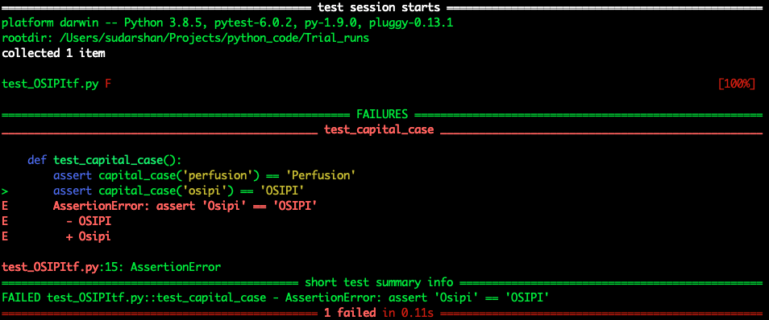

# Creating a Python test file

This guide briefly describes how to get started with writing a unit test in Python using `pytest` 

## Installing pre-requisites / dependencies

Testing is performed using `pytest` and can be installed using `pip`

	pip install -U pytest
	
or with the `conda` package manager as shown below. 

	conda install -c conda-forge pytest

`Numpy` and `scipy` are commonly used scientific packages that can similary be installed using `pip` or `conda` package managers. 

## Creating a test file

Let's assume for our purpose, all the source code is located in a folder **src**, and all the test code is located in a folder **test**. 

The **test** file corresponding to the **src** file to be tested, is named by either adding the prefix ***test_*** or the suffix ***_test*** to the name of the **src** file. In our case, the ***test_*** nomenclature has been adopted. 

### Test File Contents
An example test file is shown as follows. Details on the test-specific code can be found on [Pytest Docs](https://docs.pytest.org/en/stable/getting-started.html#).
	
	#Example 1:test_OSIPItf.py
	
	def capital_case(x):
	    return x.capitalize()
	
	def test_capital_case():
	    assert capital_case('perfusion') == 'Perfusion'
	    
It is important to note that the *test_* prefix convention use continues within the test file as well to denote which functions perform the test routines. In another example shown below, the test cases and the functions being tested are locted in different files. 

	#Example 2: test_example_functions.py
	
	from src.example_functions import add, remove_spaces
	import pytest
	
	@pytest.mark.parametrize('x, y, result', [
	    (10,10,20),
	    (12,0,12),
	    (-1,-6,-7)
	    ])
	def test_add(x, y, result):
	    assert add(x,y) == result
	
	@pytest.mark.parametrize('data, result', [
	    ('a b', 'ab'),
	    ('first last', 'firstlast')
	    ])
	def test_remove_spaces(data,result):
	    assert remove_spaces(data) == result

### Executing a test
The results of the test can then be obtained using `$ pytest` at the command line. If we perform this for Example 1, we see the following output:

Now, if example 1 were modified to
	
	#Example 1:test_OSIPItf.py
	
	def capital_case(x):
	    return x.capitalize()
	
	def test_capital_case():
	    assert capital_case('perfusion') == 'Perfusion'
	    assert capital_case('osipi') == 'OSIPI'

the output of `$ pytest` would result in a filed test as shown below.  

As indicated in the failure message, the test failed for the case where the output of `capital_case('osipi')` - the expected output *OSIPI* is different from the function output *Osipi*. 

## Useful links for unit testing with Python
1. [Pytest API](https://docs.pytest.org/en/stable/reference.html)
2. [Pytest documentation](https://buildmedia.readthedocs.org/media/pdf/pytest/latest/pytest.pdf)
3. [Basics of Unit Testing](https://realpython.com/python-testing/)
